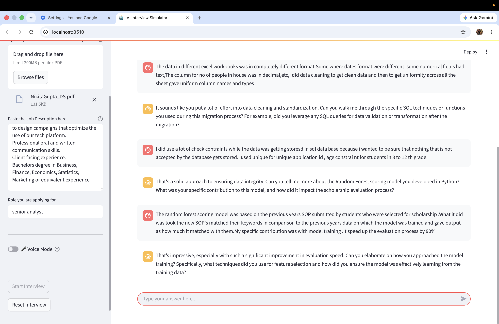
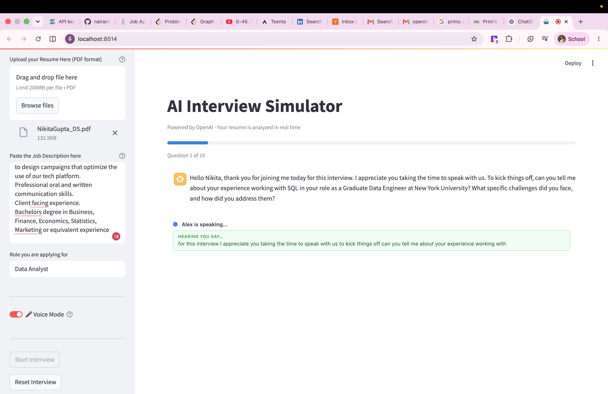
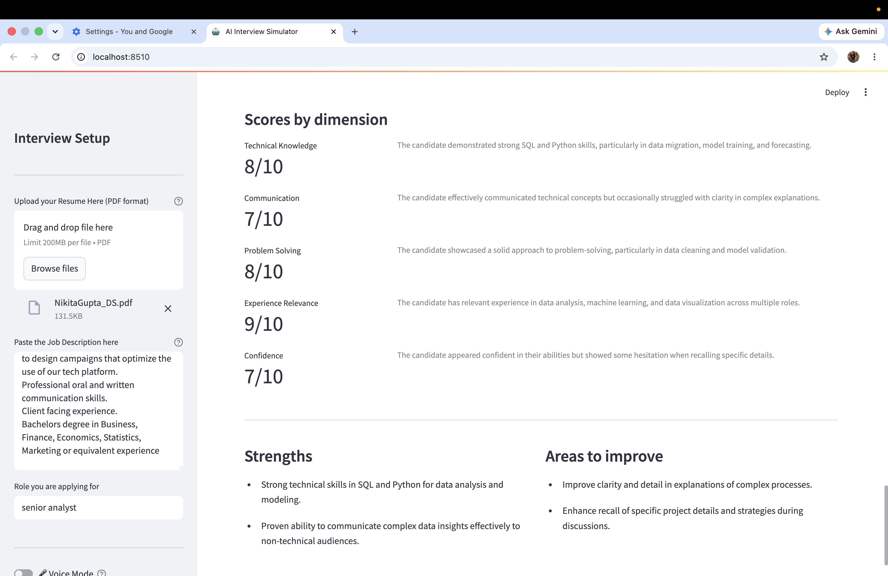
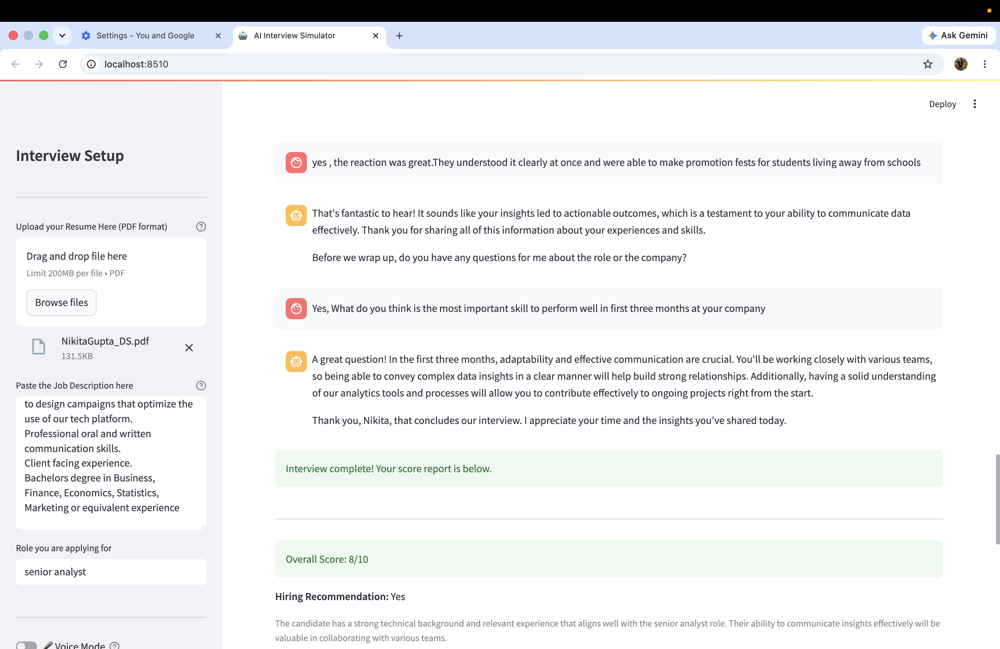

# AI Interview Simulator

An AI-powered mock interview platform that reads your resume, understands the job description, and conducts a realistic 10-question interview — with both text and voice modes. At the end you get a detailed score report and an answer guide showing how you could have responded better.

---

## Screenshots

### Live Interview (Text Mode)
The interviewer, Alex, asks follow-up questions based on your resume and the job description.



### Interview in Progress — Question Tracker
Progress bar shows which question you're on. Alex adapts questions based on your previous answers.



### Score Report
After all 10 questions, you receive a breakdown across five dimensions.



### End of Interview — Hiring Recommendation
Overall score, hiring decision, and detailed reasoning.



---

## Features

- **Resume-aware questions** — uploads and parses your PDF resume; questions are tailored to your actual experience
- **Job description matching** — compares your background against the role requirements to ask relevant questions
- **10-question adaptive interview** — Alex probes deeper based on your answers, not a fixed script
- **Voice mode** — speak your answers out loud; Alex reads questions aloud too (Chrome/Edge only)
  - 10-second no-speech countdown before repeating the question (once), then moves on
  - 5-second pause tolerance mid-answer so you can think without being cut off
  - Visual feedback: "Alex is saying…" and "Hearing you say…" boxes in real time
- **Score Report tab** — overall score out of 10, plus per-dimension breakdown: Technical Knowledge, Communication, Problem Solving, Experience Relevance, Confidence
- **Answer Guide tab** — for every question: your answer, an ideal answer, what you did well, and key points to include next time
- **Hiring recommendation** — Yes / No / Maybe with reasoning

---

## How It Works

```
Resume PDF  ──┐
Job Desc    ──┤──▶  document_processor.py  ──▶  vector_store.py (ChromaDB)
              │                                          │
              └──▶  interviewer_agent.py  ◀─────────────┘
                           │
                    asks 10 questions
                           │
                    app.py (Streamlit UI)
                           │
              ┌────────────┴────────────┐
         Text input               Voice mode
                               voice_component/index.html
                               (Web Speech API → WebSocket → app.py)
                                           │
                                    voice_pipeline.py (gTTS)
                                           │
                                    WebSocket → browser audio
                           │
                    scorer.py
              ┌────────────┴────────────┐
         Score Report            Answer Guide
```

### Key files

| File | Purpose |
|---|---|
| `app.py` | Main Streamlit app — orchestrates the interview, voice server, and results |
| `document_processor.py` | Extracts text from resume PDF, chunks it, summarises skills |
| `vector_store.py` | Builds a ChromaDB vector store from resume chunks for RAG |
| `interviewer_agent.py` | LangChain agent that plays Alex — asks and responds to questions |
| `scorer.py` | Generates the score report and answer guide from the full transcript |
| `voice_pipeline.py` | Text-to-speech via gTTS; optional Whisper fallback for STT |
| `voice_component/index.html` | Browser voice UI — Web Speech API + WebSocket state machine |

### Voice mode architecture

Voice mode uses a WebSocket server (`ws://127.0.0.1:3002`) running in a background thread inside the Streamlit process. The browser iframe connects to it directly — no CORS or iframe sandbox restrictions.

```
Browser (Web Speech API)
  │  transcript / timeout / repeat events
  ▼
WebSocket (port 3002)  ◀──▶  app.py event queue  ──▶  InterviewerAgent
                                                              │
                              WebSocket push ◀── gTTS audio (base64 MP3)
  │
  ▼
Browser plays audio → mic muted during playback → mic opens after 1.5 s
```

State machine in the browser:

```
SPEAKING  →  (TTS ends + 1.5 s)  →  WAITING
WAITING   →  (speech detected)   →  RESPONDING
WAITING   →  (10 s no speech)    →  repeat once → PROCESSING → SPEAKING
RESPONDING → (5 s silence)       →  PROCESSING  → SPEAKING
```

---

## Setup

### Option A — Docker (recommended for sharing)

Requires [Docker Desktop](https://www.docker.com/products/docker-desktop/).

```bash
git clone https://github.com/nairanikita/AI_Interview_Simulator.git
cd AI_Interview_Simulator

# Pass your OpenAI key and start
OPENAI_API_KEY=sk-... docker compose up --build
```

Open [http://localhost:8501](http://localhost:8501) in Chrome or Edge.

To stop: `docker compose down`

> **Note:** Voice mode works — the browser's microphone and speaker are on your machine, not inside the container. Both ports (8501 UI and 3002 WebSocket) are forwarded automatically.

---

### Option B — Local Python

### Prerequisites

- Python 3.11+
- Chrome or Edge (for voice mode)
- OpenAI API key

### Installation

```bash
git clone https://github.com/nairanikita/AI_Interview_Simulator.git
cd AI_Interview_Simulator
python -m venv virenv
source virenv/bin/activate        # Windows: virenv\Scripts\activate
pip install -r requirements.txt
```

### Configuration

Create a `.env` file in the project root:

```
OPENAI_API_KEY=sk-...
```

### Run

```bash
streamlit run app.py
```

Open [http://localhost:8501](http://localhost:8501) in Chrome or Edge.

---

## Usage

1. **Upload your resume** — PDF format, sidebar
2. **Paste the job description** — full text, sidebar
3. **Enter the role** you are applying for
4. *(Optional)* **Enable Voice Mode** — toggle in sidebar; Chrome/Edge required
5. Click **Start Interview**
6. Answer Alex's questions — type in the chat box, or speak if voice mode is on
7. After question 10, view your **Score Report** and **Answer Guide** tabs

### Voice mode tips

- Allow microphone access when the browser prompts
- Speak naturally — you can pause up to 5 seconds mid-answer
- If you don't respond at all, Alex repeats the question once, then moves on
- Works best in a quiet environment to avoid echo

---

## Tech Stack

| Layer | Technology |
|---|---|
| UI | Streamlit 1.45 |
| LLM | GPT-4o-mini (OpenAI) |
| Embeddings | text-embedding-3-small (OpenAI) |
| Vector store | ChromaDB (in-memory) |
| STT | Web Speech API (browser-native) |
| TTS | gTTS (Google Text-to-Speech) |
| Voice transport | WebSocket (`websockets` 13.1) |
| PDF parsing | pdfplumber |
| LLM framework | LangChain 0.3.x |

---

## CI

GitHub Actions runs on every push and pull request to `main`. It installs all dependencies and validates that every module imports cleanly. See [`.github/workflows/ci.yml`](.github/workflows/ci.yml).

Required secret: `OPENAI_API_KEY` (set in repo Settings → Secrets → Actions).
